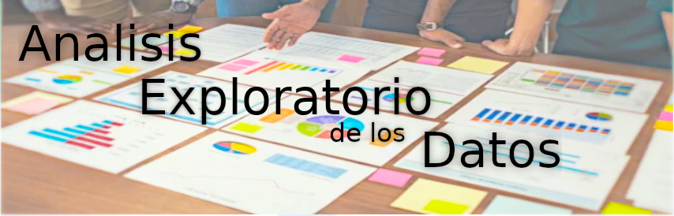

# <h1 align=center> **RecoPelis!** </h1>

# <h1 align=center>**`Machine Learning Operations (MLOps)`**</h1>

  

## Visión General del Proyecto  

Este proyecto se centra en resolver 7 endpoints relacionados con consultas y análisis de datos de películas. En resumen, los 6 primeros endpoints se enfocan en consultas específicas, permitiendo a los usuarios buscar información detallada sobre películas mediante título, actor o director. Estas consultas devuelven datos precisos, como la cantidad de votos o promedios, extraídos de la base de datos de IMDB.

La séptima función es diferente, ya que utiliza un modelo de similitud del coseno como sistema de recomendación de películas. Esta función analiza cómo los datos de cada película influyen en su emparejamiento, lo que permite recomendar películas similares a las que los usuarios ya han visto o les gustan.

objetivos:

Los 6 primeros endpoints devuelven los datos especificos solicitados

Recomendación de películas, nos va a devolver una lista que estan fuertemente relacionadas gracias a los mejores caracteristicas que definen a una pelicula

---

## <h2 align="center">carpeta ETL</h2>

 ETL : Extract, transform, load 

## **Pasos realizados**
Se dividio el ETL en dos archivos .ipynb, cada uno dirigido a los archivos de carga: **`movies_dataset`** y **`credits`**
 

+ **`ETL_MOVIES.ipynb`**: (endpoint 1,2,3 y 4)
En este archivo, iniciamos con el movies_dataset, primero convirtiendo las columnas anidadas en objetos Listas para poder desanidarlas. Posteriormente realizamos una columna llamado retorno, asegurandonos previamente que no hubieran datos nulos, transformando aquellas filas a numericas(0).  
Le damos formato a release_date, y a travez de esta columna obtenemos las columnas mes y dia para poder evaluar en una de las consultas de los endpoints.  
Para finalizar realizamos la conversion de columnas como popularity a numericos, evitandonos errores a la hora de la conversion.  
El archivo de consulta queda guardado en formato parquet

+ **`ETL_CREDITS.ipynb`**: (endpoint 5 y 6)
De este dataset, cargamos dos columnas que estan anidadas, realizamos el mismo procedimiento que en el de movies, con la diferencia que en este caso realizo una copia para analizar las dos columnas por separado,en ambos caso renombro el id a id_pelicula, para evitar que esa columna se sobreescriba con la columna id de cast/crew, elimino campos donde el nombre del actor o director esten vacias, elimino tambien columnas inecesarias o que no van a aportar nada a la consulta de los endpoints y en el caso de crew, filtro todos los datos donde 'job'=='Director'.  
Guardo en archivos parquet separados para su posterior consulta.  

---

## <h2 align="center">carpeta EDA</h2>

 EDA : Exploratory data analysis  

## **Pasos realizados**
Se dividio el ETL en dos archivos .ipynb, cada uno dirigido a los archivos de carga: **`movies_dataset`** y **`credits`**
 

+ **`UNESTED_MOVIE.ipynb`**: Volvemos a realizar un ETL, pero en este caso, tras desanidar, realizamos una separacion de datos mas coherente(datos numericos y datos categoricos), debido a que estos datos nos van a servir para luego analizar el EDA que nos deberia dar ideas cuales caracteristicas son utiles y cuales no

+ **`EDA_MOVIE.ipynb`**: (endpoint 7) Finalmente gracias a verificar las frecuencias y las distribuciones de las caracteristicas, pudimos obtener un dataset mas concreto y reducido gracias a que nos libramos de outliers, caracteristicas sesgadas, columnas con datos irrelevantes, y columnas con campos cargados pero con informacion erronea.  
De la columna genero gracias a un conteo de frecuencias en las que aparecen 1,2 o mas generos dentro de una pelicula pudimos obtener dos columnas, evitando asi utilizar dummies para los 20 generos  
Las graficas utilizadas fueron histogramas, cajas y bigotes, barras y nubes de palabras
Las columnas que quedaron para el modelo fueron (quitando title), name_collection, runtime, genero1, genero2, vote_average

---

## <h2 align="center">carpeta CONSULTAS</h2>

 Archivos Parquet 

**Aqui nos vamos a encontrar con los datos que necesitara el main, (main es el archivo donde estaran declaradas las funciones que utilizara la API), estos estan repartidos en 4 archivos.**  

*Que esten divididos en 4 archivos y no en 1 es importante, ya que nos va a evitar que cuando se inicie una funcion no tenga que cargar tantos datos inecesarios, y asi evitar que el deploy caiga debido a el consumo excesivo de memoria ram*

- actores.parquet
- directores.parquet
- movies.parquet
- consultas_ml.parquet

---

# <h1 align="center">¿Cómo se usa?</h1>
+ Primero lo primero. Clona este repositorio en tu pc: git clone
+ Ingresar a la carpeta del repositorio, y abrir la terminal para crear un entorno virtual: python3 -m venv nombre_del_entorno_a_eleccion
+ sin cerrar la terminal escribimos: source nombre_del_entorno_a_eleccion/bin/activate
+ luego instalar todas las dependencias del proyecto: pip install -r requirements.txt
+ ejecutamos la api escribiendo: uvicorn main:app --reload
+ y por ultimo dirigirse a la direccion del localhost que puede ser tanto: localhost:8000/docs o 127.0.0.1:8000/docs
  
